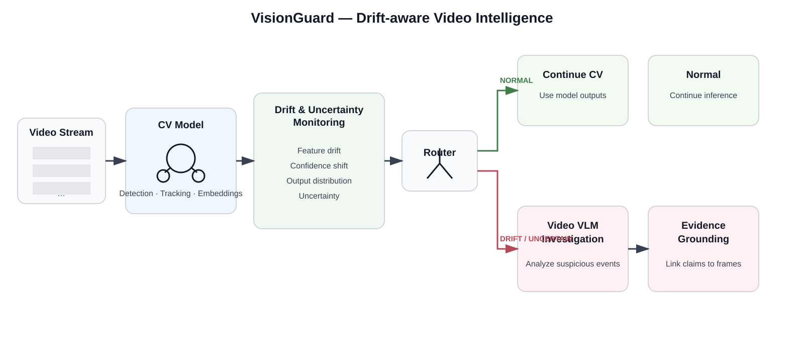

# VisionGuard

**Evidence-grounded, drift-aware video intelligence for deployed vision models.**

VisionGuard studies a practical reliability problem in deployed video systems:

> A vision model can continue running while the visual environment changes underneath it.

The system detects distributional change, measures whether that change correlates with task degradation, selectively invokes video-language reasoning for investigation, and attaches temporal evidence to the resulting claims.

## Architecture

  

## Research focus

1. Which drift signals best predict downstream model degradation?
2. Can a video-language model characterize detected drift more usefully than statistical signals alone?
3. Can claims about drift be grounded in temporally localized video evidence?
4. Can drift and uncertainty selectively route expensive reasoning without unacceptable loss in task quality?

The project treats these as empirical questions. No component is assumed to improve performance before evaluation.

## Experimental loop

reference video -> baseline CV model -> drift detection -> routing -> VLM investigation -> temporal evidence -> claim verification

## Current milestone

The controlled drift benchmark is connected to a real-video ingestion boundary and a detector-agnostic baseline evaluation interface. The next step is to instantiate this contract against a specific public video dataset and run the first baseline.

## Repository structure

- src/visionguard/data — video ingestion, sampling, and manifest contracts
- src/visionguard/baseline — detector interface, evaluation, and optional YOLO adapter
- src/visionguard/drift — drift statistics and aggregation
- src/visionguard/routing — adaptive inference decisions
- src/visionguard/evidence — evidence and claim schemas
- src/visionguard/vlm — model-provider interface
- configs — experiment configuration
- tests — unit and integration tests
- docs — research notes and methodology

## Data policy

Raw video and generated benchmark media stay outside git. Dataset-specific manifests point to local or mounted data.
